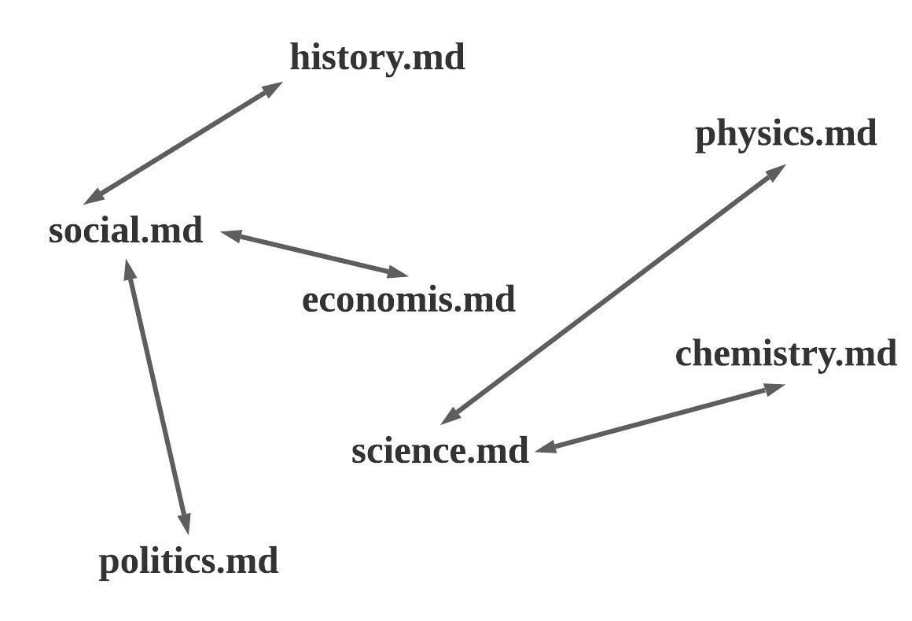
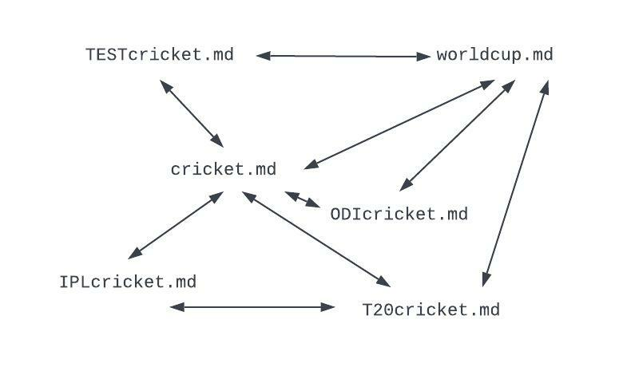

## Google PageRank

&nbsp;&nbsp;&nbsp;&nbsp;&nbsp;&nbsp;&nbsp;&nbsp;&nbsp;***PageRank*** is an algorithm used by ***Google Search*** to display websites in their search engine results based on the rank of each website. PageRank is a way of measuring the importance of website pages by counting the number and quality of links to a page to determine a rough estimate of how important the website is. The underlying assumption is that more important websites are likely to receive more links from other websites.

## Algorithm

&nbsp;&nbsp;&nbsp;&nbsp;&nbsp;&nbsp;&nbsp;&nbsp;&nbsp;Consider a page ***A*** has pages ***T1…Tn*** which point to it. The parameter ***d*** is a damping factor which can be set between 0 and 1. We usually set d to 0.85. Also ***C(A)*** is defined as the number of links going out of page ***A***. The PageRank of a page ***A*** can be determined as:

```
PR(A) = (1-d) + d (PR(T1)/C(T1) + … + PR(Tn)/C(Tn))
```

## Team Members
<table>
<td align="center"><a href="https://github.com/pramod096"><br /><sub><b>Pramod Gonegari</b></sub></a><br /></td>

<td align="center"><a href="https://github.com/saikiranreddygangidi"><br /><sub><b>SaiKiran Gangidi</b></sub></a><br /></td>
  
<td align="center"><a href="https://github.com/vallapurapuramu"><br /><sub><b>Ramu Vallapurapu</b></sub></a><br /></td>

<td align="center"><a href="https://github.com/Narendra-kumar-Gunturu"><br /><sub><b>Narendra Gunturu</b></sub></a><br /></td>

<td align="center"><a href="https://github.com/vivekd31"><br /><sub><b>Vivek Drakshapally</b></sub></a><br /></td>

<td align="center"><a href="https://github.com/Vemula23"><br /><sub><b>Venkatesh Vemula</b></sub></a><br /></td>

</table>


## Implementaion
&nbsp;&nbsp;&nbsp;&nbsp;&nbsp;&nbsp;&nbsp;&nbsp;&nbsp;Each Team Member will implement Google PageRank using ***Apache Beam*** with ***Java SDK***, in their unique folders and will communicate with all Team Members about the individual approach and suggestions.


## Member Comments

### Pramod Gonegari

&nbsp;&nbsp;&nbsp;&nbsp;&nbsp;&nbsp;&nbsp;&nbsp;&nbsp;The mini internet I have implemented to build Google PageRank, contains web pages of different books and contain links to 
other related books.



##### Execution Command
```
mvn compile exec:java -D exec.mainClass=edu.nwmissouri.s2g2.pramod.PageRankJobOnePramod
```


### Saikiran Reddy Gangidi
The **Cricket Web** I implemented Cricket web For which contains interconnection  between different webpages like cricket,worldcup and  etc Where I Build the Google PageRank for calculating the PageRank of different webpages in the web .

#### Here is the Interconnection Diagram 



#### Here is the Execution Command 

```
mvn compile exec:java -D exec.mainClass=edu.nwmissouri.s2g2.gangidi.JobOnePageRankGangidi
```


### Ramu Vallapurapu
[Link to Repository](https://github.com/pramod096/beam-java-s02g02.git)
[link to Wiki](https://github.com/pramod096/beam-java-s02g02/wiki/Ramu-Vallapurapu)
[link to Individual Code Repo](https://github.com/pramod096/beam-java-s02g02/tree/main/RamuVallapurapu)

- In this project I am implementing Google PageRank on the social media pages.
- Google PageRank using Apache Beam with Java SDK
- We can run the application using ``` mvn compile exec:java -D exec.mainClass=nwmissouri.s2g2.vallapurapu.JobOnePageRankVallapurapu ```


### Venkatesh Vemula


### Vivek Drakshapally
[Repository Link](https://github.com/pramod096/beam-java-s02g02.git)
[Wiki link](https://github.com/pramod096/beam-java-s02g02/wiki/Vivek-Drakshapally)
[Individual Code Repo Link](https://github.com/pramod096/beam-java-s02g02/tree/main/VivekDrakshapally)

- In this project i started implementing Google PageRank on the Sports Web Pages.
- Google PageRank using Apache Beam with Java SDK
- We can run the application using ``` mvn compile exec:java -D exec.mainClass=edu.nwmissouri.s2g2.drakshapally.JobOnePageRankDrakshapally ```


### Narendra Gunturu
