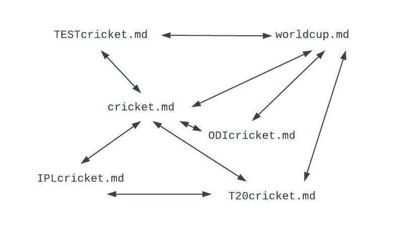

# CRICKET WEB 

This is saikiran reddy Gangidi I am developed the project using the cricket web the root folder named **cricketweb** 

Where cricket markdown files have all the details about the cricket 

[CRICKET](https://github.com/pramod096/beam-java-s02g02/blob/main/SaikiranReddyGangidi/cricketweb/cricket.md)

**Cricket has played in different formart listed below**

[ODIcricket](https://github.com/pramod096/beam-java-s02g02/blob/main/SaikiranReddyGangidi/cricketweb/ODIcricket.md)<br>
[T20cricket](https://github.com/pramod096/beam-java-s02g02/blob/main/SaikiranReddyGangidi/cricketweb/T20cricket.md)<br>
[TESTcricket](https://github.com/pramod096/beam-java-s02g02/blob/main/SaikiranReddyGangidi/cricketweb/TESTcricket.md)<br>

**Cricket has one of major tourament where all the country teams play to win a cup named**

[WORLDCUP](https://github.com/pramod096/beam-java-s02g02/blob/main/SaikiranReddyGangidi/cricketweb/worldcup.md)

**for entertainment purposes local country tourament were also played in that on of the top one is**

[IPLcricket](https://github.com/pramod096/beam-java-s02g02/blob/main/SaikiranReddyGangidi/cricketweb/IPLcricket.md)


### Here is the InterConnection web among them 




### Here is the command for Executing or Execution Commnad 

```
mvn compile exec:java -D exec.mainClass=edu.nwmissouri.s2g2.gangidi.JobOnePageRankGangidi
```
